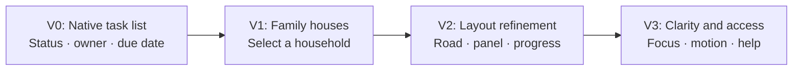

# Family Neighborhood: one staff task, four Airtable interfaces

This demo follows a paraprofessional who needs to see the work for each family on their caseload,
find deadlines, and record completed tasks. The design question was whether an interface could
make that work easier to navigate while keeping the underlying Airtable records visible and
reviewable. The [recording](../videos/README.md) shows all four versions; the
[five prompts](../prompts/family-neighborhood-demo-prompts.md) document the build sequence.

## The progression

| Version | What changed | Design reason |
| --- | --- | --- |
| V0 — native page | Standard Airtable task list with status, assigned staff, due dates, and completion controls. | Establish a useful baseline before adding custom code. |
| V1 — Omni custom element | Families became houses in a neighborhood; selecting one opens its related work. | Give staff a recognizable place to start for each family. |
| V2 — first source refinement | The car moved onto a road, the family panel became scrollable, and personal progress became easier to find. | Fix layout and navigation issues observed in V1. |
| V3 — second source refinement | Removed an unrequested “Next helpful stop,” restored house hover with keyboard focus and reduced-motion support, added a small decorative interaction, and explained points and badges in “How this works.” | Keep the playful interface understandable and grounded in Airtable data. |

## What the recording shows

The [recording guide](../videos/README.md) points to each version. At 00:45, V0 shows a native
task list; at 19:15, V3 shows the selected family's work, training requirements, and the staff
member's own progress. The diagram summarizes those visible design changes without reproducing
names or record details from the demo screen.

## What is available to reuse

The repository includes the [V3 React source snapshot](../family-neighborhood/family-neighborhood-v3.tsx),
[setup notes](../family-neighborhood/README.md), a [48-field mapping guide](../family-neighborhood/field-map.md),
and an [illustrative fictional fixture](../family-neighborhood/example-fixture.md). The source runs
inside Airtable Interface Extensions. It relies on nine configured tables and demo-specific field
IDs; copying the file into another base without remapping those IDs can show blank or zero values.

## Evidence and limits

The recording shows the versions rendered and a V3 family panel open. The source file and prompts
show the implementation path. This package does not independently establish that V3 was published
in Airtable, that every record action persisted after refresh, or that the source builds in a
different base. The [setup notes](../family-neighborhood/README.md) give the checks to perform
before operational use. No client performance or adoption outcome is claimed here.

The design deliberately avoids a staff leaderboard. Points and badges explain an individual's
progress; a task checkbox or file attachment does not prove external approval or compliance.

## Credits

Rachael Quisel designed and presented the workflow and directed its iteration with Omni and
Claude. The [Omni Refiner skill](../skills/airtable-omni-refiner/SKILL.md) is adapted from
Noam Say / Airmakers; the [repository README](../README.md#credits) preserves upstream attribution.
